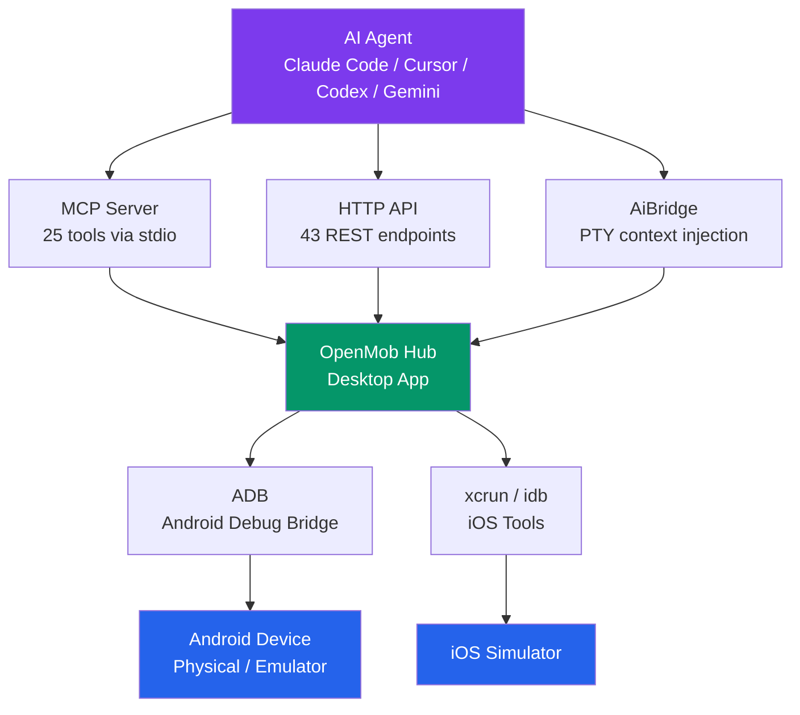

<p align="center">
  
</p>

<h1 align="center">OpenMob</h1>

<p align="center">
  <strong>Free, self-hosted alternative to <a href="https://mobai.run">MobAI</a> — give AI coding agents the ability to see and control mobile devices.</strong>
</p>

<p align="center">
  No quotas. No daily limits. No cloud dependency. Fully open source.
</p>

<p align="center">
  <a href="#quick-start">Quick Start</a> &bull;
  <a href="#setup-for-ai-tools">AI Tool Setup</a> &bull;
  <a href="#api-reference">API Reference</a> &bull;
  <a href="#manual-installation">Manual Install</a> &bull;
  <a href="openmob_skills/SKILL.md">Skill Reference</a>
</p>

---

## The Problem

AI coding agents (Claude Code, Cursor, Codex, Gemini) can write mobile app code but **can't see or interact with the actual device**. They're coding blind — they can't verify if a button works, if a layout looks right, or if a login flow actually succeeds.

**MobAI** solves this but:
- Free tier: 100 points/day, 1 device only
- Plus ($4.99/mo): still 1 device, 1 machine
- Pro ($9.99/mo): unlimited devices but requires internet for license validation
- Closed source desktop app

## The Solution

**OpenMob** gives your AI agents eyes and hands on mobile devices — completely free, self-hosted, and open source.



### What AI Agents Can Do — 25 MCP Tools

| Category | Capability | How |
|----------|-----------|-----|
| **See** | Screenshot | Capture screen as base64 PNG |
| **See** | UI tree | Accessibility tree with element indices |
| **See** | Current activity | See foreground app + screen name |
| **See** | Notifications | Read notification bar content |
| **See** | Keyboard status | Detect if soft keyboard is showing |
| **Touch** | Tap | By element index or x,y coordinates |
| **Touch** | Type text | Into any focused input field |
| **Touch** | Swipe/scroll | Direction-based (up/down/left/right) or coordinates |
| **Touch** | Long press | Hold at position for configurable duration |
| **Touch** | Drag and drop | From point A to point B |
| **Touch** | Press keys | Home, Back, Enter, Volume, Power, etc. |
| **Apps** | Launch app | By package name |
| **Apps** | Kill app | Force-stop by package name |
| **Apps** | Install APK | From local file path |
| **Apps** | Uninstall app | By package name |
| **Apps** | List installed apps | 3rd-party or all |
| **Apps** | Clear app data | Reset to fresh install state |
| **Apps** | Grant permissions | Auto-grant all runtime permissions |
| **Navigate** | Open URL | Deep links and web URLs |
| **Navigate** | Go home | Press home button |
| **Navigate** | Unlock device | Wake screen + swipe to dismiss lock |
| **Debug** | Device logs | Read logcat with tag/level/line filters |
| **Debug** | Wait for element | Poll until UI element appears on screen |
| **Files** | Push/pull files | Transfer files to/from device |
| **Device** | WiFi/Airplane toggle | Control connectivity |
| **Device** | Screen rotation | Portrait, landscape, reverse |
| **Device** | Screen recording | Start/stop video recording |
| **Testing** | Run test scripts | Structured multi-step tests with pass/fail |

All tools return **NLP-friendly summaries** so non-technical QA testers see "Tapped the Login button" instead of raw JSON.

## Quick Start

### Option 1: Pre-built Binaries

Download from [Releases](https://github.com/wm-jenildgohel/openmob/releases):

**Linux:**
```bash
tar xzf openmob-linux-x64.tar.gz
cd openmob-linux-x64
./openmob_hub
```

**Windows:**
```
Extract openmob-windows-x64.zip
Double-click openmob_hub.exe
```

The app auto-detects missing tools and installs them. Connect an Android device via USB and it appears automatically.

### Option 2: Build from Source

See [Build from Source](#build-from-source) section below.

## Auto-Setup

OpenMob Hub **automatically installs everything** on first launch:

| Tool | Auto-Install Method | Fallback |
|------|-------------------|----------|
| **ADB** | Downloads from Google (~8MB) | [Manual ADB Install](#adb) |
| **Node.js** | winget (Windows), download (Linux), brew (macOS) | [Manual Node.js Install](#nodejs) |
| **MCP Server** | Builds from source automatically | [Manual MCP Build](#nodejs) |
| **AI Tool Configs** | Auto-configures all detected AI tools | [Manual Setup](#setup-for-ai-tools) |
| **OpenMob Skill** | Auto-installs to Claude Code, Cursor, etc. | [Manual Skill Install](#setup-for-ai-tools) |

All tools stored in `~/.openmob/tools/` — no admin/sudo required.

### Auto-Update

The Hub checks for updates on startup and can download + install new versions automatically from GitHub Releases. The app restarts itself after updating.

### If Auto-Install Fails

<details>
<summary>Manual installation instructions</summary>

#### ADB

**Windows:**
```powershell
winget install Google.PlatformTools
```

**Linux:**
```bash
sudo apt install adb
```

**macOS:**
```bash
brew install android-platform-tools
```

#### Node.js

**Windows:**
```powershell
winget install OpenJS.NodeJS.LTS
```

**Linux:**
```bash
curl -fsSL https://deb.nodesource.com/setup_20.x | sudo -E bash -
sudo apt install nodejs
```

**macOS:**
```bash
brew install node@20
```

Then build the MCP server:
```bash
cd openmob_mcp && npm install && npm run build
```

#### AiBridge (Optional)

Only needed for terminal-based AI agents (Claude Code CLI, Codex CLI, Gemini CLI).

**Pre-built:** Download from [Releases](https://github.com/wm-jenildgohel/openmob/releases)

**From source (requires Rust):**
```bash
curl --proto '=https' --tlsv1.2 -sSf https://sh.rustup.rs | sh
cd openmob_bridge && cargo build --release
```

</details>

## Setup for AI Tools

OpenMob Hub **auto-configures your AI tools** from the System Check screen. Supports:

| Tool | Method | Auto-Config |
|------|--------|------------|
| Cursor | MCP (stdio) | Yes |
| Claude Desktop | MCP (stdio) | Yes |
| Claude Code | MCP + Skill | Yes |
| Windsurf | MCP rules | Yes |
| VS Code (Copilot) | MCP (stdio) | Yes |
| Codex CLI | AGENTS.md | Yes |
| Gemini CLI | GEMINI.md | Yes |

<details>
<summary>Manual MCP configuration</summary>

### Cursor / Claude Desktop / Windsurf

Add to MCP settings:
```json
{
  "mcpServers": {
    "openmob": {
      "command": "node",
      "args": ["build/app/index.js"],
      "cwd": "/path/to/openmob_mcp"
    }
  }
}
```

### Claude Code

```bash
claude mcp add openmob node build/app/index.js --cwd /path/to/openmob_mcp
```

### VS Code (Copilot)

Add to `.vscode/mcp.json`:
```json
{
  "servers": {
    "openmob": {
      "type": "stdio",
      "command": "node",
      "args": ["build/app/index.js"],
      "cwd": "${workspaceFolder}/../openmob_mcp"
    }
  }
}
```

### Any HTTP-capable Agent

Point to the Hub API directly:
```bash
curl http://localhost:8686/api/v1/devices/
```

</details>

## Components

### 1. Hub — Flutter Desktop App (`openmob_hub/`)

The brain. Manages devices, runs the HTTP API, provides the desktop UI.

- **43 REST endpoints** for complete device control
- **Auto-discovers** Android devices (USB/WiFi/emulator) and iOS Simulators
- **Desktop UI** — device list, live screen preview, process controls, log viewer, test runner, system check
- **Auto-installer** — detects and installs missing tools, configures AI integrations
- **Auto-updater** — checks GitHub Releases, downloads + replaces + relaunches
- **Tech**: Flutter, Dart, shelf HTTP server, rxdart state management

### 2. MCP Server — TypeScript (`openmob_mcp/`)

The bridge to AI tools. Exposes device tools via [Model Context Protocol](https://modelcontextprotocol.io/).

- **25 MCP tools** — device control, app management, debugging, testing, file transfer
- **NLP-friendly responses** — every tool returns human-readable summaries
- **Works with** — Cursor, Claude Desktop, Windsurf, VS Code, any MCP client
- **Stateless** — all calls proxy to the Hub HTTP API
- **Auto-detects Hub** — probes ports 8686-8690 automatically
- **SOLID/SRP architecture** — app/, mcp/common/, mcp/tools/device/, mcp/tools/action/
- **Tech**: TypeScript, @modelcontextprotocol/sdk, zod

### 3. AiBridge — Rust CLI (`openmob_bridge/`)

Optional. Wraps terminal AI agents with context injection.

- **PTY wrapper** — wraps Claude Code, Codex, Gemini CLI in a pseudo-terminal
- **HTTP injection API** on `localhost:9999` — POST text into the agent when idle
- **Idle detection** — regex-based, built-in patterns for 3 major agents
- **Cross-platform** — works on Linux, macOS, Windows (ConPTY)
- **Tech**: Rust, portable-pty, axum, tokio, clap

## API Reference

### Devices
| Method | Endpoint | Description |
|--------|----------|-------------|
| GET | `/api/v1/devices/` | List all connected devices |
| GET | `.../screenshot` | Capture screenshot (base64 PNG) |
| GET | `.../ui-tree?visible=true` | Get UI accessibility tree |
| GET | `.../current-activity` | Get foreground app/screen |
| GET | `.../apps?third_party=true` | List installed apps |
| GET | `.../logcat?lines=100&tag=MyApp&level=error` | Get device logs |
| GET | `.../keyboard` | Check if keyboard is showing |
| GET | `.../notifications` | Read notification bar |
| GET | `.../files?path=/sdcard/` | List files on device |

### Actions
| Method | Endpoint | Body | Description |
|--------|----------|------|-------------|
| POST | `.../tap` | `{"index": N}` or `{"x": 720, "y": 1480}` | Tap element or coordinates |
| POST | `.../type` | `{"text": "hello"}` | Type into focused field |
| POST | `.../swipe` | `{"direction": "up"}` or `{"x1":720,"y1":1800,"x2":720,"y2":800}` | Swipe/scroll |
| POST | `.../keyevent` | `{"keyCode": 3}` | Press key (Home=3, Back=4) |
| POST | `.../launch` | `{"package": "com.app"}` | Launch app |
| POST | `.../terminate` | `{"package": "com.app"}` | Kill app |
| POST | `.../install` | `{"path": "/path/to/app.apk"}` | Install APK |
| POST | `.../uninstall` | `{"package": "com.app"}` | Uninstall app |
| POST | `.../clear-data` | `{"package": "com.app"}` | Clear app data |
| POST | `.../open-url` | `{"url": "https://..."}` | Open URL on device |
| POST | `.../unlock` | — | Wake + swipe to unlock |
| POST | `.../wait-for-element` | `{"text": "Login", "timeout_ms": 10000}` | Wait until element appears |
| POST | `.../grant-permissions` | `{"package": "com.app"}` | Grant all permissions |
| POST | `.../wifi` | `{"enabled": true}` | Toggle WiFi |
| POST | `.../airplane` | `{"enabled": true}` | Toggle airplane mode |
| POST | `.../rotation` | `{"rotation": 1}` | Set rotation (0=portrait, 1=landscape) |
| POST | `.../file/push` | `{"local": "/path", "remote": "/sdcard/file"}` | Push file to device |
| POST | `.../file/pull` | `{"remote": "/sdcard/file", "local": "/path"}` | Pull file from device |
| POST | `.../record/start` | `{"max_duration": 180}` | Start screen recording |
| POST | `.../record/stop` | — | Stop recording |
| POST | `.../gesture` | `{"type": "long_press", "x": 540, "y": 960}` | Long press, drag, pinch |

### Health
| Method | Endpoint | Description |
|--------|----------|-------------|
| GET | `/health` | Hub health check |

## OpenMob vs MobAI

| Feature | MobAI Free | MobAI Pro ($9.99/mo) | OpenMob |
|---------|-----------|---------------------|---------|
| Devices | 1 | Unlimited | **Unlimited** |
| Daily quota | 100 points | Unlimited | **Unlimited** |
| Machines | 1 | 3 | **Unlimited** |
| MCP tools | 12 | 12 | **25** |
| Offline mode | No | 7 days | **Always offline** |
| Source code | Closed | Closed | **MIT licensed** |
| Telemetry | Yes | Yes | **None** |
| Cloud dependency | Required | Required | **None** |
| Auto-install tools | No | No | **Yes** |
| AI tool auto-config | No | No | **Yes** |
| Auto-update | No | No | **Yes** |
| NLP responses | No | No | **Yes** |
| App install/uninstall | Yes | Yes | **Yes** |
| Device logs (logcat) | Yes | Yes | **Yes** |
| Wait for element | No | No | **Yes** |
| File push/pull | No | No | **Yes** |
| Grant permissions | No | No | **Yes** |
| Screen recording | No | No | **Yes** |
| WiFi/Airplane toggle | No | No | **Yes** |
| Screen rotation | No | No | **Yes** |
| Notifications | No | No | **Yes** |
| Price | Free (limited) | $99/year | **Free forever** |

## Build from Source

**Prerequisites:**
- Flutter 3.29.3+ — `flutter --version`
- Node.js 18+ — `node --version`
- Rust 1.70+ — `rustc --version` (optional, for AiBridge)

```bash
git clone https://github.com/wm-jenildgohel/openmob.git
cd openmob

# Hub (Flutter Desktop)
cd openmob_hub && flutter pub get && flutter build linux --release && cd ..
# Windows: flutter build windows --release

# MCP Server (TypeScript)
cd openmob_mcp && npm install && npm run build && cd ..

# AiBridge (Rust — optional)
cd openmob_bridge && cargo build --release && cd ..

# Run
cd openmob_hub && flutter run -d linux
```

## Supported Platforms

### Device Automation
| Platform | Connection | Screenshot | UI Tree | Interactions | Install APK |
|----------|-----------|------------|---------|-------------|-------------|
| Android (physical) | USB, WiFi ADB | Yes | Yes | Yes | Yes |
| Android (emulator) | ADB auto-detect | Yes | Yes | Yes | Yes |
| iOS (simulator) | xcrun simctl | Yes | Yes (idb) | Yes (idb) | No |

### Hub Desktop App
| OS | Status |
|----|--------|
| Linux (x64) | Pre-built binary |
| Windows (x64) | Pre-built binary |
| macOS | Build from source |

### AI Tool Integration
| Tool | Method | Auto-Config | Auto-Skill |
|------|--------|------------|------------|
| Cursor | MCP (stdio) | Yes | — |
| Claude Desktop | MCP (stdio) | Yes | — |
| Claude Code | MCP + Skill | Yes | Yes |
| Windsurf | MCP rules | Yes | — |
| VS Code (Copilot) | MCP (stdio) | Yes | — |
| Codex CLI | AGENTS.md | Yes | Yes |
| Gemini CLI | GEMINI.md | Yes | Yes |

## Project Structure

```
openmob/
├── openmob_hub/          # Flutter Desktop Hub (48 files, 9.7K lines)
│   ├── lib/
│   │   ├── core/         # ResColors, constants
│   │   ├── models/       # Device, UiNode, TestScript, AiTool, ProcessInfo
│   │   ├── server/       # shelf HTTP API + 43 routes
│   │   ├── services/     # ADB, DeviceManager, ProcessManager, AutoSetup, UpdateService
│   │   └── ui/           # Screens + Widgets (rxdart, zero setState for data)
│   └── assets/           # App logo
├── openmob_mcp/          # MCP Server (29 files, 1.1K lines, SOLID/SRP)
│   └── src/
│       ├── app/          # Bootstrap, server factory, tool registration
│       ├── mcp/          # common/ (schemas, response, hub-client) + tools/ (25 tools)
│       └── types/        # TypeScript interfaces
├── openmob_bridge/       # AiBridge CLI (9 files, 1K lines, Rust)
│   └── src/              # PTY handler, bridge, detector, queue, HTTP server
├── openmob_skills/       # Skill package for AI tools
│   ├── SKILL.md          # Full API reference + QA patterns
│   ├── install.sh        # Auto-install script
│   ├── agents/           # OpenAI Agents SDK definitions
│   └── mcp-configs/      # Ready configs for each AI tool
├── .github/workflows/    # CI/CD — builds Linux + Windows + macOS on tag push
└── LICENSE               # MIT
```

## Contributing

```bash
git clone https://github.com/YOUR_USERNAME/openmob.git

cd openmob_hub && flutter pub get && flutter run -d linux  # Hub
cd openmob_mcp && npm install && npm run build             # MCP
cd openmob_bridge && cargo build                           # AiBridge
```

## License

MIT License. See [LICENSE](LICENSE).

---

<p align="center">
  <strong>Built as a free alternative to MobAI.</strong><br>
  If AI agents can write code, they should be able to see and test it too — without paying per-tap.
</p>
